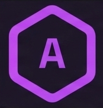
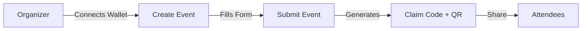
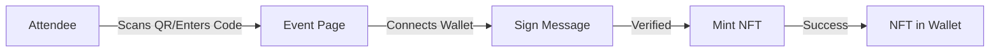

<div align="center">
  
  
  # Attest
  
  ### On-Chain Attendance System for the Solana Ecosystem
  
  [](https://react.dev/)
  [](https://solana.com/)
  [](https://www.typescriptlang.org/)
  [](https://www.metaplex.com/)
  
  [Features](#-features) • [Quick Start](#-quick-start) • [Tech Stack](#-tech-stack) • [Documentation](#-documentation) • [Roadmap](#-roadmap)
</div>

---

## 🎯 What is Attest?

**Attest** is a decentralized proof-of-attendance protocol built on Solana that enables event organizers to create verifiable, on-chain attendance records through NFTs. Whether you're hosting a conference, workshop, meetup, or virtual event, Attest provides a seamless way to reward attendees with unique, collectible NFTs that prove their participation.

### Why Attest?

- **🔐 Verifiable Attendance**: Immutable on-chain proof that can't be forged or duplicated
- **⚡ Lightning Fast**: Built on Solana for instant minting and low transaction costs
- **🎨 Customizable**: Create unique NFT designs for each event
- **📱 Mobile-Friendly**: QR code-based claiming for seamless check-ins
- **🌐 Decentralized**: No centralized authority controls your attendance records
- **💰 Cost-Effective**: Minimal fees compared to other blockchain solutions

---

## ✨ Features

### For Event Organizers

- **🎫 Create Events**: Set up events with custom details, images, and claim codes
- **📊 Dashboard**: Track attendance metrics and claim statistics in real-time
- **🔗 QR Code Generation**: Automatically generate shareable QR codes for easy claiming
- **🎨 Custom NFT Metadata**: Design unique NFT artwork and metadata for each event
- **👥 Attendee Management**: View who claimed NFTs and when

### For Attendees

- **👛 Wallet Integration**: Connect with Phantom, Solflare, Backpack, and other Solana wallets
- **📸 QR Code Scanning**: Quick claim process via QR code
- **🔒 Signature Verification**: Prove wallet ownership through message signing
- **🎁 Instant NFT Minting**: Receive your attendance NFT immediately
- **🖼️ NFT Gallery**: View all your collected attendance NFTs in your wallet

### Technical Features

- **🔄 Dual Backend Support**: Works with both Node.js/MongoDB and Supabase
- **🌐 REST API**: Clean, documented API for integrations
- **🎨 Modern UI**: Beautiful interface built with shadcn/ui and Tailwind CSS
- **📱 Responsive Design**: Works seamlessly on desktop and mobile
- **🔐 Secure**: No private keys stored, wallet-based authentication

---

## 🚀 Quick Start

### Prerequisites

- **Node.js** 18+ and npm
- **MongoDB** (local or Atlas) OR **Supabase** account
- **Solana Wallet** (Phantom recommended)
- **Devnet SOL** for testing (get from [Solana Faucet](https://faucet.solana.com/))

### Installation

1. **Clone the repository**
   ```bash
   git clone https://github.com/yourusername/event-beacon.git
   cd event-beacon
   ```

2. **Install frontend dependencies**
   ```bash
   npm install
   ```

3. **Install backend dependencies**
   ```bash
   cd backend
   npm install
   cd ..
   ```

4. **Set up MongoDB** (if using Node.js backend)
   ```bash
   # Windows (using Chocolatey)
   choco install mongodb
   
   # Start MongoDB
   mongod --dbpath C:\data\db
   ```

5. **Configure environment variables**

   **Frontend** (`.env` in root):
   ```env
   VITE_USE_LOCAL_API=false
   VITE_API_URL=http://localhost:5000
   ```

   **Backend** (`backend/.env`):
   ```env
   MONGODB_URI=mongodb://localhost:27017/attest
   SOLANA_RPC_URL=https://api.devnet.solana.com
   SOLANA_PAYER_SECRET_KEY=your_base58_secret_key_here
   PORT=5000
   FRONTEND_URL=http://localhost:8080
   ```

6. **Start the development servers**

   **Terminal 1 - Backend:**
   ```bash
   cd backend
   npm run dev
   ```

   **Terminal 2 - Frontend:**
   ```bash
   npm run dev
   ```

7. **Open your browser**
   
   Navigate to `http://localhost:8080` and connect your Solana wallet!

📚 **For detailed setup instructions**, see:
- [INSTALLATION.md](INSTALLATION.md) - Complete installation guide
- [QUICK_START.md](QUICK_START.md) - 5-minute quick start
- [LOCAL_TESTING.md](LOCAL_TESTING.md) - Local testing guide
- [SOLANA_SETUP.md](SOLANA_SETUP.md) - Solana wallet setup
- [backend/README.md](backend/README.md) - Backend-specific setup

---

## 🛠️ Tech Stack

### Frontend
- **Framework**: React 18.3 + TypeScript 5.8
- **Build Tool**: Vite 5.4
- **Styling**: Tailwind CSS 3.4 + shadcn/ui components
- **UI Components**: Radix UI primitives
- **Routing**: React Router 6.30
- **State Management**: TanStack Query (React Query)
- **Forms**: React Hook Form + Zod validation
- **Icons**: Lucide React

### Blockchain
- **Network**: Solana (Devnet/Mainnet)
- **SDK**: @solana/web3.js 1.98
- **Wallet Adapters**: Phantom, Solflare, Backpack, Torus
- **NFT Standard**: Metaplex Token Metadata (MPL)
- **Token Program**: SPL Token

### Backend (Node.js)
- **Runtime**: Node.js + Express
- **Database**: MongoDB + Mongoose
- **NFT Minting**: Metaplex Foundation SDK
- **Image Processing**: Sharp
- **CORS**: Configured for cross-origin requests

### Backend (Alternative - Supabase)
- **Database**: PostgreSQL
- **Functions**: Deno Edge Functions
- **Authentication**: Supabase Auth
- **Storage**: Supabase Storage

### Development Tools
- **Linting**: ESLint 9
- **Package Manager**: npm / Bun
- **Version Control**: Git
- **Deployment**: Vercel (frontend), Render/Railway (backend)

---

## 📁 Project Structure

```
event-beacon/
├── src/                          # Frontend source code
│   ├── components/               # React components
│   │   ├── CreateEventForm.tsx   # Event creation form
│   │   ├── ClaimNFT.tsx         # NFT claiming interface
│   │   └── ...                   # UI components (buttons, cards, etc.)
│   ├── pages/                    # Route pages
│   │   ├── Index.tsx            # Landing page
│   │   ├── Events.tsx           # Events listing
│   │   ├── EventDetail.tsx      # Single event view
│   │   ├── CreateEvent.tsx      # Create event page
│   │   └── Claim.tsx            # Claim NFT page
│   ├── contexts/                 # React contexts
│   │   └── WalletContext.tsx    # Solana wallet provider
│   ├── hooks/                    # Custom React hooks
│   ├── lib/                      # Utilities and API clients
│   │   ├── api-adapter.ts       # Backend abstraction layer
│   │   └── utils.ts             # Helper functions
│   └── integrations/             # Third-party integrations
│       └── supabase/            # Supabase client (optional)
├── backend/                      # Node.js backend
│   └── src/
│       ├── models/               # MongoDB schemas
│       │   ├── Event.js         # Event model
│       │   └── Claim.js         # Claim model
│       ├── routes/               # API routes
│       │   ├── events.js        # Event endpoints
│       │   ├── claims.js        # Claim endpoints
│       │   └── mint.js          # NFT minting endpoint
│       ├── lib/                  # Backend utilities
│       │   ├── solana.js        # Solana connection
│       │   └── metaplex.js      # NFT minting logic
│       └── server.js            # Express server
├── public/                       # Static assets
│   ├── logo.png                 # App logo
│   └── favicon.ico              # Favicon
├── docs/                         # Documentation
│   ├── INSTALLATION.md          # Setup guide
│   ├── LOCAL_TESTING.md         # Testing guide
│   ├── SOLANA_SETUP.md          # Solana configuration
│   └── CODEBASE_ANALYSIS.md     # Architecture overview
└── package.json                  # Dependencies
```

---

## 🔄 How It Works

### Event Creation Flow



1. **Organizer** connects their Solana wallet
2. Creates an event with details (name, description, image, date)
3. System generates a unique claim code and QR code
4. Organizer shares the code/QR with attendees

### Claiming Flow



1. **Attendee** scans QR code or enters claim code
2. Connects their Solana wallet (Phantom, Solflare, etc.)
3. Signs a verification message to prove ownership
4. Backend mints NFT using Metaplex
5. NFT appears in attendee's wallet immediately

### Technical Flow

```
Frontend (React) → API Adapter → Backend (Express/Supabase)
                                      ↓
                                 MongoDB/Postgres
                                      ↓
                              Solana RPC (Devnet)
                                      ↓
                              Metaplex NFT Mint
                                      ↓
                              Attendee Wallet
```

---

## 📖 Documentation

| Document | Description |
|----------|-------------|
| [INSTALLATION.md](INSTALLATION.md) | Complete installation and setup guide |
| [QUICK_START.md](QUICK_START.md) | Get started in 5 minutes |
| [LOCAL_TESTING.md](LOCAL_TESTING.md) | Test the full flow locally |
| [SOLANA_SETUP.md](SOLANA_SETUP.md) | Configure Solana wallets and keys |
| [WALLET_SETUP.md](WALLET_SETUP.md) | Set up Phantom and other wallets |
| [CODEBASE_ANALYSIS.md](CODEBASE_ANALYSIS.md) | Architecture deep dive |
| [CODEBASE_AUDIT.md](CODEBASE_AUDIT.md) | Code quality and security audit |
| [backend/README.md](backend/README.md) | Backend-specific documentation |

---

## 🎨 API Reference

### Events API

#### `GET /api/events`
Get all active events
```json
Response: [
  {
    "_id": "event_id",
    "name": "Web3 Conference 2024",
    "description": "Annual blockchain conference",
    "claimCode": "WEB3-2024",
    "imageUrl": "https://...",
    "date": "2024-12-25T00:00:00Z",
    "organizerWallet": "ABC...XYZ"
  }
]
```

#### `POST /api/events`
Create a new event
```json
Request: {
  "name": "Event Name",
  "description": "Event description",
  "claimCode": "UNIQUE-CODE",
  "imageUrl": "https://...",
  "date": "2024-12-25",
  "organizerWallet": "wallet_address"
}
```

#### `GET /api/events/code/:claimCode`
Find event by claim code

### Claims API

#### `POST /api/claims`
Create a new claim
```json
Request: {
  "eventId": "event_id",
  "walletAddress": "wallet_address",
  "signature": "signed_message"
}
```

#### `GET /api/claims/check/:eventId/:walletAddress`
Check if wallet already claimed

### Minting API

#### `POST /api/mint`
Mint NFT for a claim
```json
Request: {
  "claimId": "claim_id",
  "walletAddress": "recipient_wallet",
  "eventName": "Event Name",
  "eventDate": "2024-12-25"
}

Response: {
  "success": true,
  "mintAddress": "NFT_mint_address",
  "signature": "transaction_signature"
}
```

---

## 🚢 Deployment

### Frontend (Vercel)

1. Push code to GitHub
2. Import project in Vercel
3. Set environment variables:
   ```
   VITE_API_URL=https://your-backend.com
   ```
4. Deploy!

### Backend (Render/Railway)

1. Create new Web Service
2. Connect GitHub repository
3. Set build command: `cd backend && npm install`
4. Set start command: `cd backend && npm start`
5. Add environment variables:
   ```
   MONGODB_URI=mongodb+srv://...
   SOLANA_RPC_URL=https://api.mainnet-beta.solana.com
   SOLANA_PAYER_SECRET_KEY=...
   FRONTEND_URL=https://your-frontend.vercel.app
   NODE_ENV=production
   ```

### Database (MongoDB Atlas)

1. Create cluster at [mongodb.com/cloud/atlas](https://www.mongodb.com/cloud/atlas)
2. Get connection string
3. Update `MONGODB_URI` in backend environment

---

## 🗺️ Roadmap

### ✅ Phase 1: Core Functionality (Completed)
- [x] Event creation and management
- [x] QR code generation
- [x] Wallet integration (Phantom, Solflare, Backpack)
- [x] NFT minting on Solana devnet
- [x] Claim verification system
- [x] Responsive UI with shadcn/ui
- [x] Node.js + MongoDB backend
- [x] Dual backend support (Supabase/Node.js)

### 🚧 Phase 2: Enhanced Features (In Progress)
- [ ] **Mainnet Deployment**: Move from devnet to Solana mainnet
- [ ] **Event Analytics Dashboard**: Detailed metrics and insights
- [ ] **Batch Minting**: Mint multiple NFTs at once for large events
- [ ] **Email Notifications**: Alert attendees when NFTs are minted
- [ ] **Social Sharing**: Share attendance on Twitter/social media
- [ ] **Event Categories**: Tag and filter events by type
- [ ] **Search & Discovery**: Find events by location, date, category

### 🔮 Phase 3: Advanced Capabilities (Planned)
- [ ] **Multi-Chain Support**: Expand to Ethereum, Polygon, Base
- [ ] **Dynamic NFTs**: Update NFT metadata based on event milestones
- [ ] **Tiered Attendance**: Different NFT tiers (VIP, General, etc.)
- [ ] **Event Series**: Link multiple events into a series with collection rewards
- [ ] **Gamification**: Badges, achievements, leaderboards
- [ ] **Mobile App**: Native iOS/Android apps
- [ ] **White-Label Solution**: Custom branding for organizations
- [ ] **Marketplace Integration**: Trade/sell attendance NFTs

### 🌟 Phase 4: Ecosystem Growth (Future)
- [ ] **DAO Governance**: Community-driven feature decisions
- [ ] **Token Gating**: Require specific NFTs to access events
- [ ] **Proof-of-Participation Rewards**: Airdrops for active attendees
- [ ] **Event Sponsorships**: Sponsored NFTs and branded experiences
- [ ] **API Marketplace**: Third-party integrations and plugins
- [ ] **Cross-Platform Identity**: Unified attendance profile across platforms
- [ ] **Virtual Event Integration**: Zoom, Discord, Twitter Spaces
- [ ] **Metaverse Events**: VR/AR attendance tracking

### 💡 Community Requests
Have an idea? [Open an issue](https://github.com/yourusername/event-beacon/issues) or join our Discord!

---

## 🤝 Contributing

We welcome contributions! Here's how you can help:

1. **Fork the repository**
2. **Create a feature branch**: `git checkout -b feature/amazing-feature`
3. **Commit your changes**: `git commit -m 'Add amazing feature'`
4. **Push to the branch**: `git push origin feature/amazing-feature`
5. **Open a Pull Request**

### Development Guidelines

- Follow the existing code style
- Write meaningful commit messages
- Add tests for new features
- Update documentation as needed
- Ensure all tests pass before submitting PR

---

## 🐛 Troubleshooting

### Common Issues

**MongoDB Connection Error**
```bash
# Ensure MongoDB is running
mongod --dbpath C:\data\db
```

**Solana Mint Fails**
- Check payer wallet has sufficient SOL
- Verify `SOLANA_PAYER_SECRET_KEY` is valid base58 format
- Confirm RPC URL is accessible

**CORS Errors**
- Update `FRONTEND_URL` in backend `.env`
- Ensure frontend uses correct `VITE_API_URL`

**Wallet Won't Connect**
- Install Phantom wallet extension
- Switch to Devnet in wallet settings
- Refresh page and try again

---

## 📄 License

This project is licensed under the MIT License - see the [LICENSE](LICENSE) file for details.

---

## 🙏 Acknowledgments

- **Solana Foundation** for the incredible blockchain infrastructure
- **Metaplex** for NFT standards and tooling
- **shadcn/ui** for beautiful UI components
- **Vercel** for seamless deployment
- **The Solana Community** for continuous support and feedback

---

## 📞 Contact & Support

- **GitHub Issues**: [Report bugs or request features](https://github.com/yourusername/event-beacon/issues)
- **Discord**: [Join our community](#) (Coming soon)
- **Twitter**: [@AttestProtocol](#) (Coming soon)
- **Email**: support@attest.xyz (Coming soon)

---

<div align="center">
  
  **Built with ❤️ on Solana**
  
  [⭐ Star us on GitHub](https://github.com/yourusername/event-beacon) • [🐦 Follow on Twitter](#) • [💬 Join Discord](#)
  
</div>
